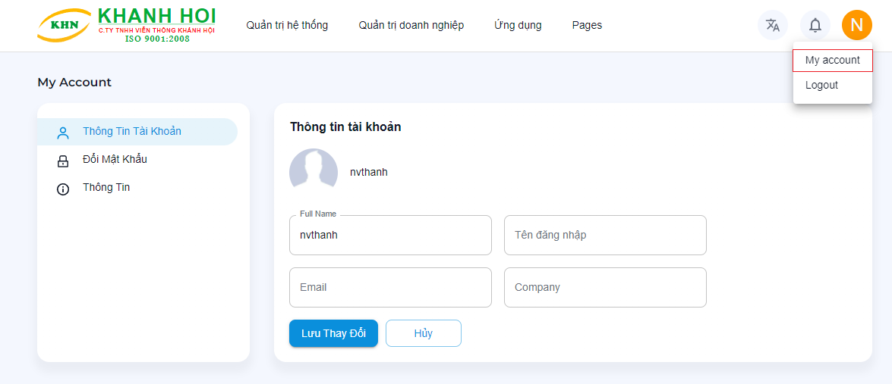
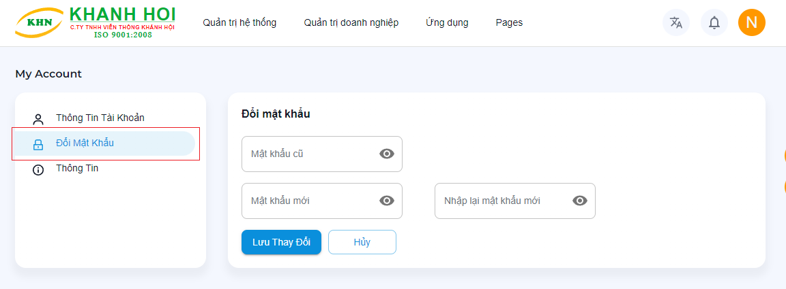

# Quản lý tài khoản

Để xem thông tin tài khoản, đổi mật khẩu cá nhân. Quý khách chọn `biểu tượng tài khoản` -> chọn `My account`

## Thông tin tài khoản

Quý khách cập nhật thông tin: 

- `Họ và tên`: Không được để trống hoặc dài quá 50 kí tự
- `Email`: Là địa chỉ email, không được để trống hoặc dài quá 50 kí tự
- `Số điện thoại`: Không được để trống hoặc dài quá 20 kí tự
- `Địa chỉ`

## Đổi mật khẩu

Trong mục `My accout` chọn `Đổi mật khẩu`.

- `Mật khẩu cũ*`: Mật khẩu hiện tại
- `Mật khẩu mới*`: Mật khẩu quý khách muốn thay đổi (ít nhất 6 kí tự).
- `Nhập lại mật khẩu mới*`

(*) là bắt buộc

