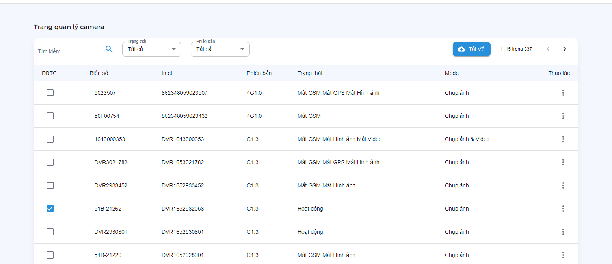
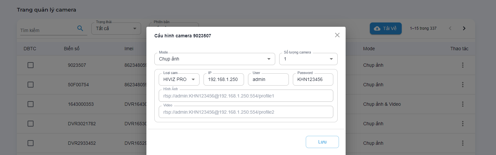
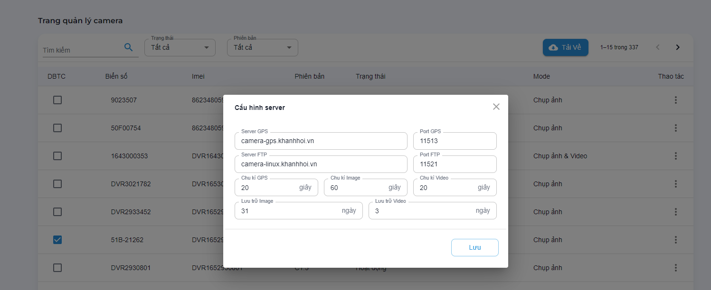

# Cấu hình camera

Các chức năng quản lý, theo dõi và chỉnh sửa thiết bị lắp camera
```text
.
└── Ứng dụng
    ├── ...
    ├── Cấu hình camera
        ├── Theo dõi danh sách thiết bị lắp camera
        ├── Bật/Tắt DBTC
        ├── Sửa cấu hình camera
        ├── Sửa cấu hình server nhận dữ liệu camera
    ├── ...
```

## Theo dõi danh sách thiết bị lắp camera

Theo dõi theo các dữ liệu:

- Biển số xe.
- Imei.
- Phiên bản thiết bị.
- Trạng thái thiết bị: `Hoạt động`, `Mất GSM`, `Mất GPS`, `Mất hình ảnh`, `Mất video`.
- Chế độ camera: `Chụp ảnh`, `Quay video`, `Chụp ảnh + video`.

Chức năng chính:

- Tìm kiếm theo `biển số`, `imei` thiết bị.
- Lọc theo `trạng thái`, `phiên bản`.
- Xuất dữ liệu.



## Bật/Tắt DBTC

?> Trên dòng thiết bị cần bật/tắt đồng bộ tổng cục (ĐBTC) > Click vào cột ĐBTC.

## Sửa cấu hình camera

Trên dòng thiết bị cần sửa > bấm vào cột `Thao tác` > chọn `Cấu hình cam`.

- Mode: Chế độ camera `Chụp ảnh`, `Quay video`, `Chụp ảnh + video`.
- Số lượng camera: tối thiểu 1 - tối đa 4.
- Loại camera: Các loại camera hiện tại công ty đang sử dụng lắp đặt.
- IP: Địa chỉ cấu hình camera.
- User.
- Password.

** Sau khi nhập đủ thông tin. bấm `Lưu` để lưu lại cấu hình.**
!> Lưu ý: Sau khi cập nhật cấu hình cam, cần khởi động lại thiết bị để thiết bị nhận cấu hình mới.



## Sửa cấu hình server nhận dữ liệu camera

Trên dòng thiết bị cần sửa > bấm vào cột `Thao tác` > chọn `Cấu hình server`.

- Server GPS: `domain` + `port`.
- Server FTP: `domain` + `port`.
- Chu kì gửi tin: `GPS`, `Image`, `Video`.
- Thời gian lưu trừ: `Image`, `Video`.


