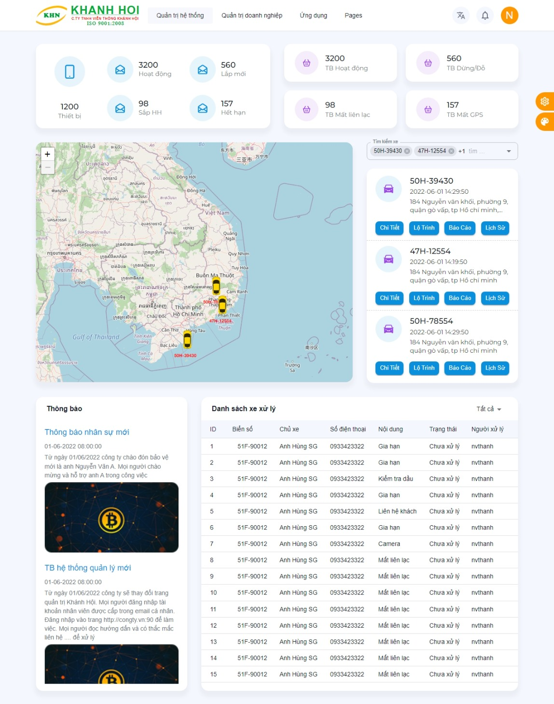

# Dashboard

!> Chức năng hiện đang trong quá trình `phát triển`. Trong lần cập nhật sau chúng tôi sẽ hoàn thiện dự kiến từ 17- 20/06/2022.

Các thành phần trong giao diện:

- Tổng số thiết bị
  - Tổng `thiết bị đã tạo`.
  - Tổng thiết bị hoạt động `chưa hết hạn dịch vụ`.
  - Tổng thiết bị sắp hết hạn dịch vụ `7 ngày sắp tới`.
  - Tổng thiết bị `lắp mới trong tháng`.
- Trạng thái thiết bị
  - Thiết bị đang hoạt động có `GSM + GPS`.
  - Thiết bị `dừng/đỗ` (thời gian dừng < 15 phút, Thời gian đõ > 15 phút).
  - Thiết bị mất liên lạc `mất GSM trên 30 phút`.
  - Thiết bị `mất GPS`.
- Bản đồ và tìm kiếm xe
  - Hiện thị xe có biển số trên bản đồ. Click vào xe đó sẽ hiện thông tin xe trên bản đồ.
  - Tìm kiếm `Nhập biển số`, `imei`, `tên tài khoản` để chọn ra xe cần tìm kiếm.
  - Chi tiết: Thông tin thiết bị, thông tin xe, thông tin sim.
  - Lộ trình thiết bị. Thời gian tối đa `1 ngày`.
  - Báo cáo các loại: báo cáo tổng hợp, báo cáo dừng đỗ, báo cáo tài xế...
  - Lịch sử thiết bị: quá trình `lắp đặt`, `gia hạn`, `bảo hành`...
- Thông báo
- Công việc các công việc được giao đến quý khách.

## Thông tin xe

Trong mục tìm kiếm. nhập biển số hoặc imei xe cần tìm kiếm > chọn thông tin của xe.

!> Lưu ý: để tải lại dữ liệu vui lòng click nút reload trên góc danh sách thiết bị. Một số lỗi khi bấm chọn xe nhưng không hiện xe, quý khách vui lòng tải lại trang.

## Tra cứu lịch sử

Trong mục tìm kiếm. nhập biển số hoặc imei xe cần tìm kiếm > chọn lịch sử xe.

- Chọn ngày cần tìm kiếm `tối đa 1 ngày`.
- Click play để mô phỏng quá trình `di chuyển` của xe.
- Click pause để tại `dừng`
- Click download: `Đang cập nhật`.

## Báo cáo

Trong mục tìm kiếm. nhập biển số hoặc imei xe cần tìm kiếm > chọn báo cáo xe.

- Chọn ngày cần tra cứu. `Tối đa 30 ngày`.
- Chọn loại báo cáo.
- Bấm tìm kiếm.
- Tải về: `Đang cập nhật`.

