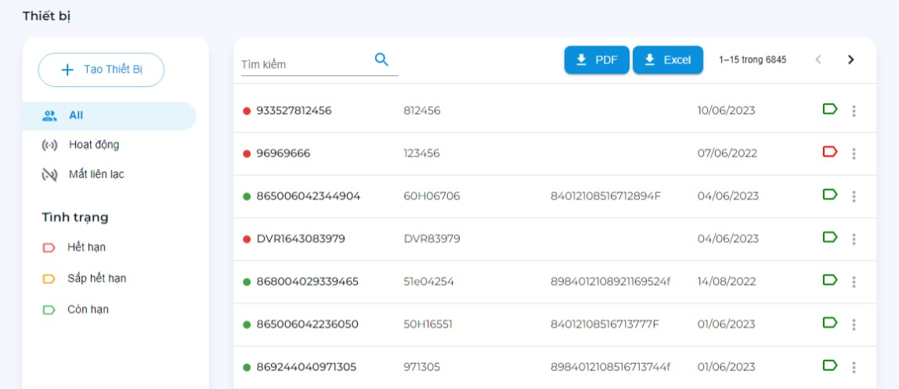
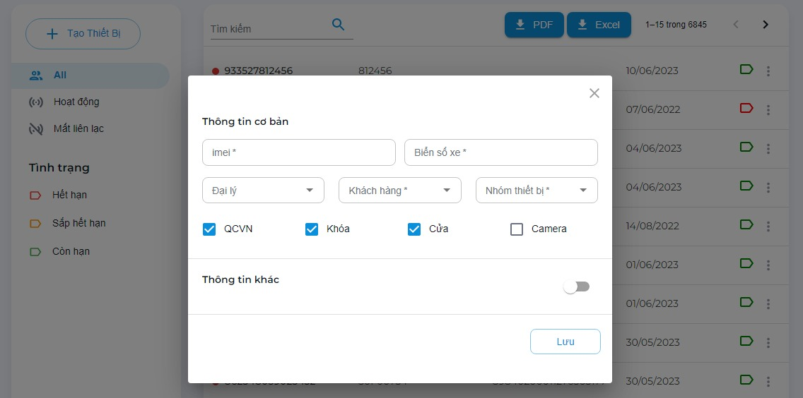
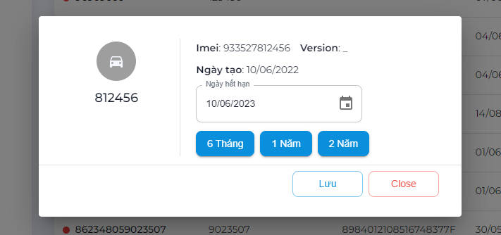
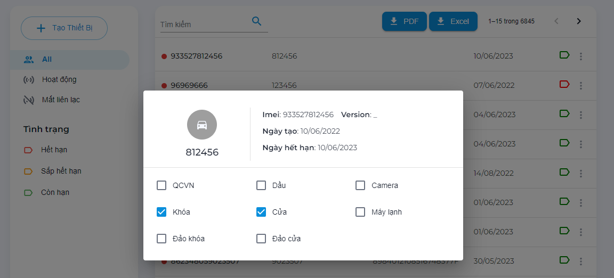
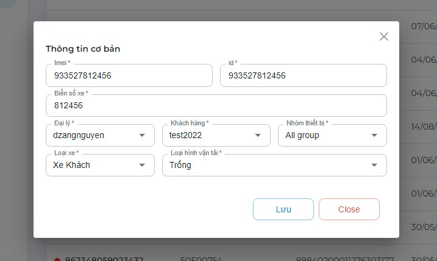

# Quản trị thiết bị

Các chức năng quản lý, theo dõi và chỉnh sửa thiết bị
```text
.
└── Quản trị hệ thống
    ├── ...
    ├── Quản trị thiết bị
        ├── Theo dõi thiết bị
        ├── Tạo thiết bị
        ├── Gia hạn thiết bị
        ├── Cấu hình thiết bị
        ├── Sửa thiết bị
        ├── Xuất dữ liệu
        ├── Xóa thiết bị
    ├── ...
```
## Theo dõi thiết bị

Theo dõi theo các dữ liệu:

- Trạng thái: `Tất cả`, `Hoạt động`, `Mất liên lạc GSM trên 30 phút`
- Tình trạng: thiết bị `hết hạn`, `sắp hết hạn 7 ngày`, `còn hạn`.
- Từ khóa: nhập tìm kiếm theo `biển số`, `imei`, `serial`.



## Tạo thiết bị

Click vào `Tạo thiết bị` > Nhập thông tin vào hộp thoại tạo thiết bị

!> Lưu ý: Vui lòng nhập đủ thông tin. Khi đổi tài khoản `đại lý` vui lòng đổi lại `khách hàng` và `nhóm thiết bị`.

- `Imei*` : Imei thiết bị.
- `Biển số*` : Biển số xe.
- `Đại lý*` : Đại lý quản lý thiết bị.
- `Khách hàng*` : Tài khoản khách hàng thuộc đại lý trên.
- `Nhóm thiết bị*` : Group trong tài khoản khách hàng.
- `Cấu hình thiết bị`: Các cấu hình thiết bị
- Nhập thêm thông tin: click `switch` thông tin khác. Cập nhật các thông tin bổ sung (Loại hình vận tải, loại xe).

(*) là bắt buộc.



## Gia hạn thiết bị

- **Cách 1**: Rê chuột vào thiết bị cần chỉnh sửa. bên góc phải sẽ hiện danh sách chức năng. Chọn `Gia hạn` (nút thứ 1).
- **Cách 2**: Click vào thiết bị cần chỉnh sửa. Hộp thoại chi tiết thiết bị hiển thị, góc trên cùng sẽ hiện danh sách chức năng. Chọn `Gia hạn` (nút thứ 1).



## Cấu hình thiết bị

- **Cách 1**: Rê chuột vào thiết bị cần chỉnh sửa. bên góc phải sẽ hiện danh sách chức năng. Chọn `Cấu hình` (nút thứ 2).
- **Cách 2**: Click vào thiết bị cần chỉnh sửa. Hộp thoại chi tiết thiết bị hiển thị, góc trên cùng sẽ hiện danh sách chức năng. Chọn `Cấu hình` (nút thứ 2).

?> Một số chức năng phải mở chức năng trước thì mới có thể bật tắt. **Ví dụ** Mở khóa > Đảo khóa

_* Để thoát hộp thoại: bấm vào màn hình xám phía ngoài._




## Sửa thiết bị

- **Cách 1**: Rê chuột vào thiết bị cần chỉnh sửa. bên góc phải sẽ hiện danh sách chức năng. Chọn `Sửa` (nút thứ 3).
- **Cách 2**: Click vào thiết bị cần chỉnh sửa. Hộp thoại chi tiết thiết bị hiển thị, góc trên cùng sẽ hiện danh sách chức năng. Chọn `Sửa` (nút thứ 3).

!> Lưu ý: Vui lòng nhập đủ thông tin. Khi đổi tài khoản `đại lý` vui lòng đổi lại `khách hàng` và `nhóm thiết bị`.

- `Imei*` : Imei thiết bị.
- `ID*` : Mã định danh thiết bị.
- `Biển số*` : Biển số xe.
- `Đại lý*` : Đại lý quản lý thiết bị.
- `Khách hàng*` : Tài khoản khách hàng thuộc đại lý trên.
- `Nhóm thiết bị*` : Group trong tài khoản khách hàng.
- `Loại xe*` : Group trong tài khoản khách hàng.
- `Loại hình vận tải*` : Group trong tài khoản khách hàng.

(*) là bắt buộc. Bấm `Lưu` để hoàn tất.

_* Để thoát hộp thoại: bấm `Close` hoặc vào màn hình xám phía ngoài._



## Xuất dữ liệu

?> Xuất dữ liệu tìm kiếm hoặc toàn bộ thiết bị bằng nút `Tải về`. Lựa chọn loại file *.PDF hoặc *.Xlxs


## Xóa thiết bị

- **Cách 1**: Rê chuột vào thiết bị cần chỉnh sửa. bên góc phải sẽ hiện danh sách chức năng. Chọn `Xóa` (nút thứ 4).
- **Cách 2**: Click vào thiết bị cần chỉnh sửa. Hộp thoại chi tiết thiết bị hiển thị, góc trên cùng sẽ hiện danh sách chức năng. Chọn `Xóa` (nút thứ 4).

!> Lưu ý: Thiết bị sẽ bị xóa. dữ liệu trên thiết bị sẽ mất trong sau 24 giờ hàng ngày.
