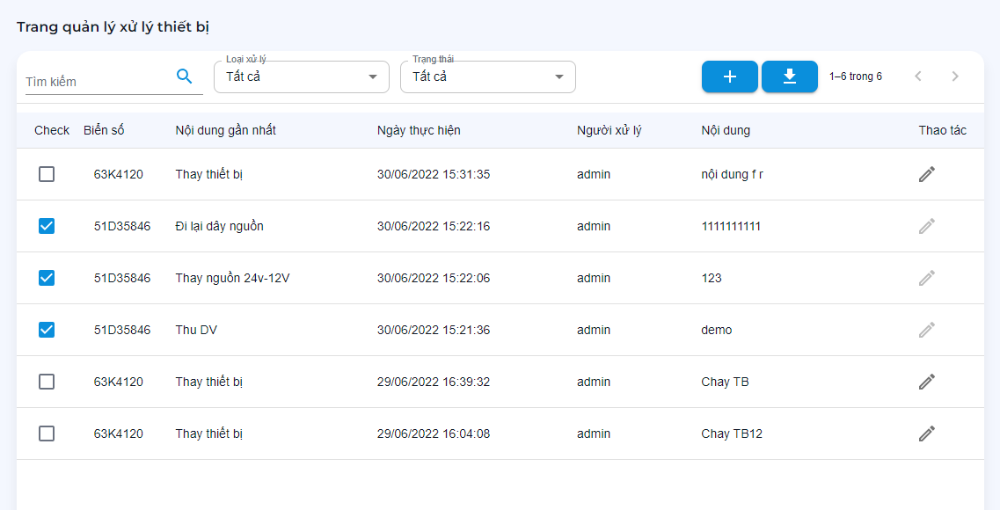
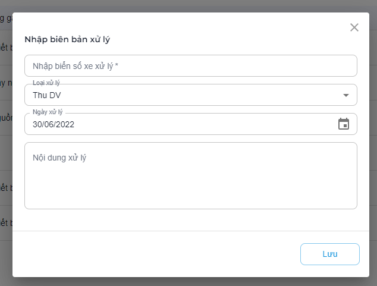

# Biên bản xử lý xe

Các chức năng quản lý, theo dõi và chỉnh sửa biên bản xử lý thiết bị trên xe
```text
.
└── Ứng dụng
    ├── ...
    ├── Xử lý thiết bị
        ├── Theo dõi danh sách biên bản xử lý
        ├── Bật/Tắt xác nhận biên bản
        ├── Tạo biên bản
        ├── Sửa biên bản
        ├── Xuất danh sách biên bản
    ├── ...
```
## Theo dõi danh sách biên bản xử lý

Theo dõi theo các dữ liệu:

- Biển số xe.
- Nội dung xử lý.
- Ngày thực hiện.
- Người thực hiện.
- Ghi chú.

Chức năng chính:

- Tìm kiếm theo `biển số`, `imei` thiết bị.
- Lọc theo `Loại xử lý`, `Trạng thái xử lý`.
- Tạo biên bản.
- Xuất dữ liệu.



## Bật/Tắt xác nhận biên bản

?> Trên dòng thiết bị cần bật/tắt xác nhận biên bản > Click vào cột Check.

## Tạo/Sửa biên bản

?> __Tạo biên bản:__ Trên góc phải > bấm vào `icon tạo (+)`.

?> __Sửa biên bản:__ Trên dòng thiết bị cần sửa > bấm vào `icon sửa` góc phải.

- Biển số xe*: Nhập biển số xe đã xử lý, Nếu xe không tồn tại trong quản lý thiết bị sẽ báo lỗi.
- Loại xử lý: Các loại xử lý thường gặp. Để thêm loại xử lý vui lòng liên hệ người quản trị để thêm mới.
- Ngày xử lý:
- Nội dung xử lý: Các thông tin bổ sung phí `dịch vụ`, `lỗi cụ thể`, `thông tin khách, tài xế`...

**Sau khi nhập đủ thông tin. bấm `Lưu` để lưu lại cấu hình.**

