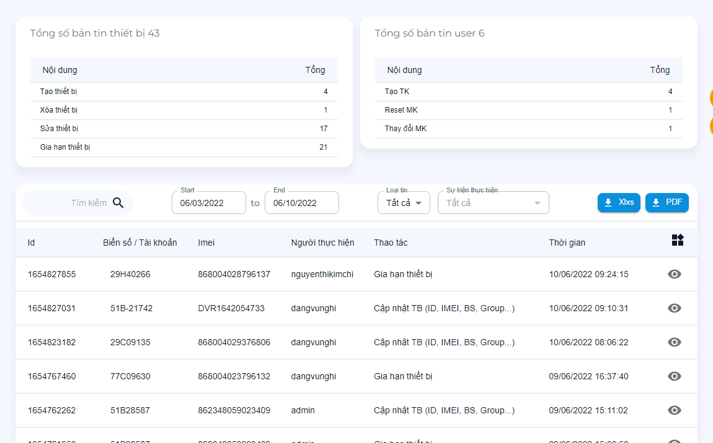

# Theo dõi hoạt động

> Lưu trữ các sự kiện, hoạt động của user trên website quản trị

Các chức năng:

- Time: Ngày bắt đầu đến ngày kết thúc **không quá 30 ngày**.
- Loại tin: `Thiết bị`, `User`
- Sự kiện: Dựa theo loại tin cho ra các sự kiện của loại tin đó. _Ví dụ loại tin `thiết bị` có sự kiện `tạo thiết bị`, `gia hạn thiết bị`..._
- Tìm kiếm: `Tìm kiếm` nội dung có chứa từ khóa cần tìm.

?> Để xem chi tiết logs. Click biểu tượng góc ngoài cùng.

?> Sau khi lọc dữ liệu theo chức năng có thể xuất danh sách theo *.PDF hoặc *.Xlxs

