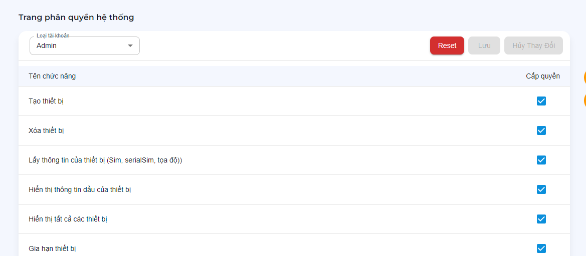

# Phân quyền nhóm tài khoản

> Cho phép các quyền hoạt động trên nhóm tài khoản.

- Loại tài khoản: `Admin`, `Đại Lý`, `Nhân viên`.

?> Để khôi phục mặc định quyền cơ bản cho nhóm tài khoản. Click `Reset`.

