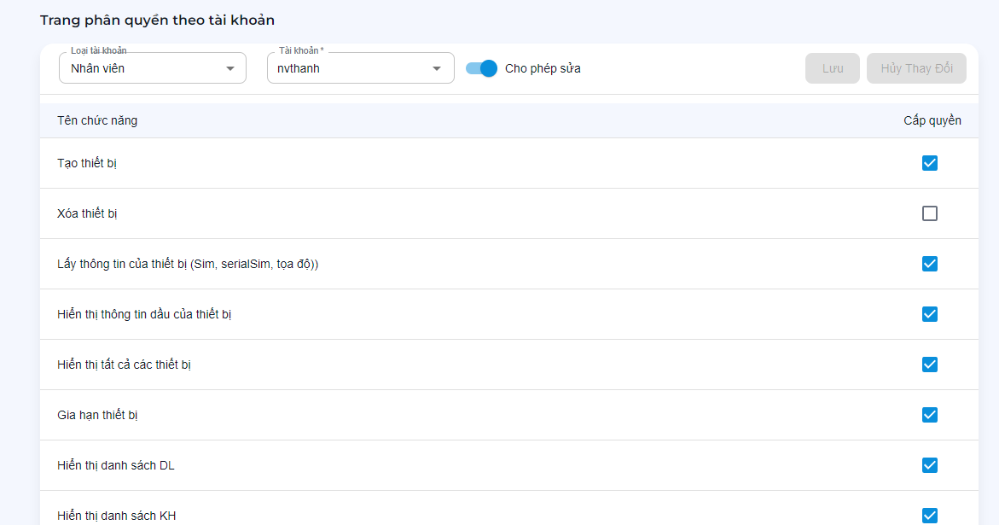

# Phân quyền tài khoản

> Cho phép các quyền hoạt động trên tài khoản.

- Loại tài khoản: `Admin`, `Đại Lý`, `Nhân viên`.
- Tài khoản: Chọn tài khoản cần chỉnh sửa quyền hệ thống.
- Bật/Tắt cho phép sửa: thay đổi riêng / theo nhóm tài khoản.

