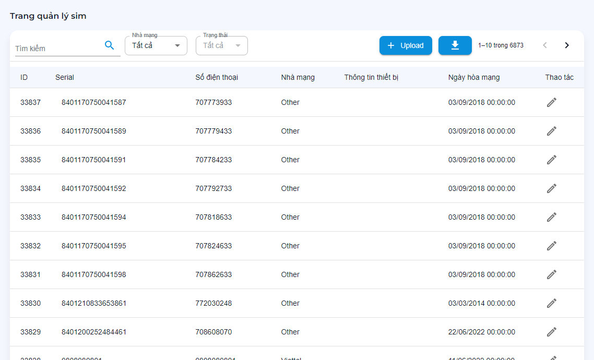

# Quản trị sim

Các chức năng quản lý, theo dõi và chỉnh sửa sim
```text
.
└── Quản trị hệ thống
    ├── ...
    ├── Quản trị sim
        ├── Danh sách sim trên thiết bị
        ├── Upload sim
        ├── Edit sim
    ├── ...
```

## Danh sách sim trên thiết bị

Theo dõi dựa trên các dữ liệu:

- Nhà mạng: `Tất cả`, `Viettel`, `Vinaphone`, `MobiPhone`.
- Từ khóa: nhập tìm kiếm theo `biển số`, `imei`, `serial`.



## Upload sim

Trên thanh `quản lý sim` > `Upload` > Chọn `file` cần upload > click vào `tạo sim` cần thêm.

!> Lưu ý: File upload cần theo file mẫu.


## Edit sim

Trên góc phải từng dòng thông tin `sim` > Chọn `sửa`.


