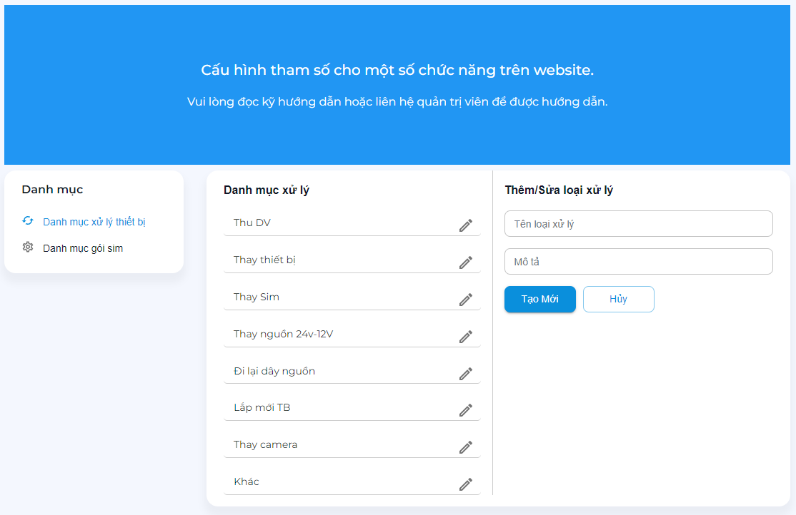
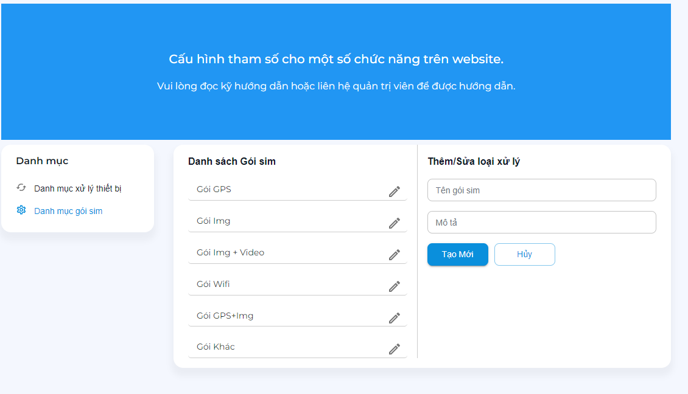

# Cấu hình hệ thống

Cập nhật các tham số cấu hình trên hệ thống.
```text
.
└── Ứng dụng
    ├── ...
    ├── Cấu hình hệ thống
        ├── Danh mục xử lý thiết bị
        ├── Danh mục gói sim
        ├── ...
    ├── ...
```



## Danh mục xử lý thiết bị

Cho phép thêm sửa các danh mục trong trang xử lý thiết bị. 

Chức năng chính:

- Xem danh sách các loại danh mục xử lý.
- Thêm danh mục xử lý.
- Sửa danh mục xử lý.


## Danh mục gói sim

Cho phép thêm sửa các gói cước sim trong trang quản lý sim.

Chức năng chính:

- Xem danh sách các loại gói cước sim.
- Thêm gói cước sim.
- Sửa gói cước sim.


