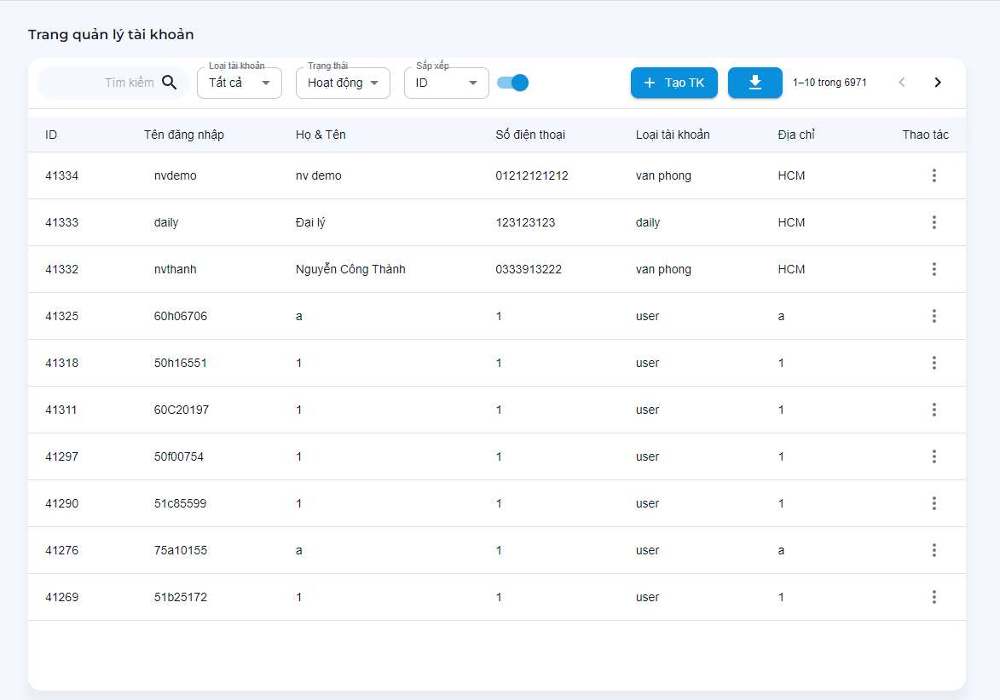
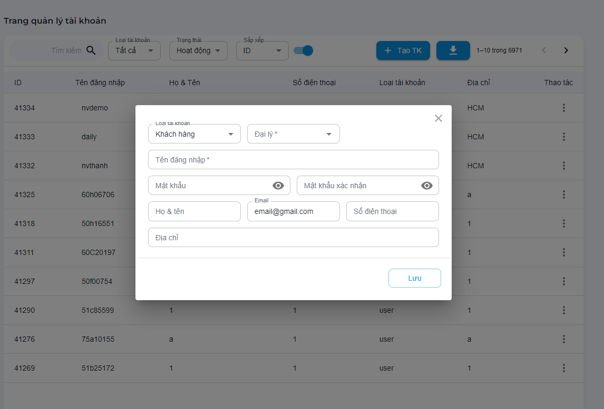
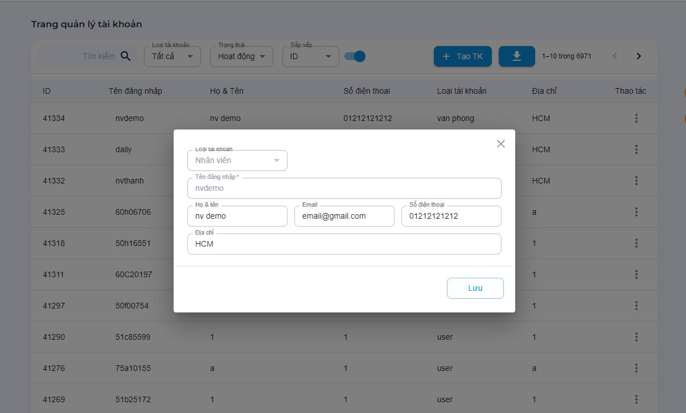

# Quản trị user

Các chức năng quản lý, theo dõi và chỉnh sửa tài khoản
```text
.
└── Quản trị hệ thống
    ├── ...
    ├── Quản lý tài khoản
        ├── Theo dõi tài khoản
        ├── Tạo tài khoản
        ├── Sửa tài khoản
        ├── Reset mật khẩu
        ├── Xuất dữ liệu
        ├── Xóa tài khoản
        ├── Khôi phục tài khoản
    ├── ...
```

## Theo dõi tài khoản

Theo dõi theo các dữ liệu:

- Loại tài khoản: `Tất cả`, `Admin`, `Đại lý`, `Khách hàng`, `User`, `Nhân viên`.
- Trạng thái: `Hoạt động`, `Ngưng hoạt động`.
- Từ khóa: nhập tìm kiếm theo `biển số`, `Tên đăng nhập`, `Họ tên`.



## Tạo tài khoản

Click vào `Tạo TK` > Nhập thông tin vào hộp thoại tạo tài khoản

!> Lưu ý: Vui lòng nhập đủ thông tin. Khi đổi tài khoản `đại lý` vui lòng đổi lại `khách hàng`.

- `Loại tài khoản*` : Đại lý | Khách hàng | User | Nhân viên.
- `Đại lý*` : Khi chọn `Loại tài khoản` là `Khách hàng`.
- `Khách hàng*` : Khi chọn `Loại tài khoản` là `User`.
- `Tên đăng nhập*` : Tên đăng nhập **Viết liền không dấu**.
- `Mật khẩu*`: Mật khẩu.
- `Mật khẩu xác nhận*`: Trùng với mật khẩu.
- `Họ và tên*`: Nhập họ tên khách hàng.
- `Số điện thoại*`: Nhập đúng thông tin số điện thoại.
- `Email`
- `Địa chỉ`

(*) là bắt buộc.



## Sửa tài khoản

Trên dòng tài khoản cần sửa > bấm vào cột `Thao tác` > chọn `Sửa tài khoản`.

!> Lưu ý: Chỉ đổi thông tin khách hàng. Muốn đổi loại tài khoản thì `xóa tài khoản` và `tạo tài khoản mới` với `tên tài khoản mới`.



## Reset mật khẩu

Trên dòng tài khoản cần sửa > bấm vào cột `Thao tác` > chọn `reset mật khẩu`.

## Xuất dữ liệu

?> Xuất dữ liệu tìm kiếm hoặc toàn bộ thiết bị bằng nút `Tải về`. Loại file *.Xlxs

## Xóa tài khoản

Trên dòng tài khoản cần sửa > bấm vào cột `Thao tác` > chọn `Xóa tài khoản`.

## Khôi phục tài khoản

Trên cột trạng thái chọn `Ngưng hoạt động` > Trên dòng tài khoản cần Khôi phục > bấm vào cột `Thao tác` > chọn `Khôi phục`.
